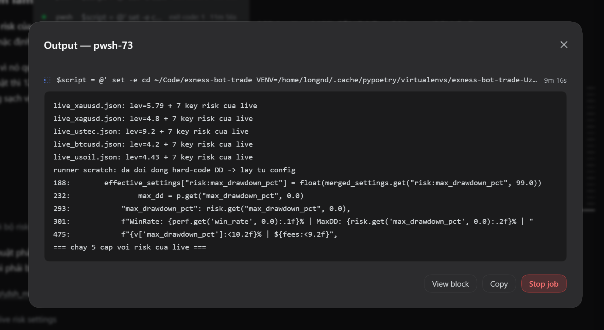
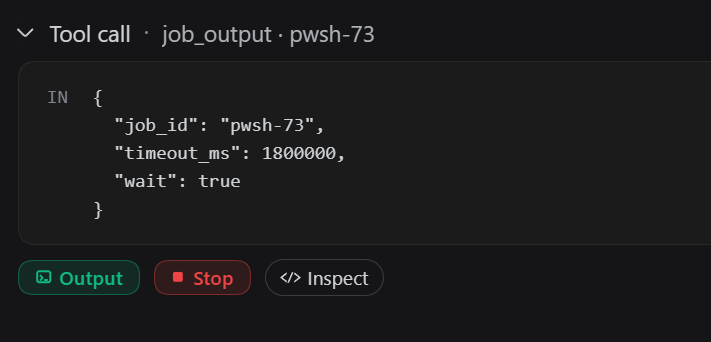

# dsh-better-uiux

Two UI enhancements for **DeepSeek Harness (DSH Desktop)**, together in one
**Better UIUX** section in Settings, each behind its own switch.

| Switch | What it does | Default |
| --- | --- | --- |
| **Live terminal output** | Streams foreground command output and background-job output into the transcript: live blocks with a pulsing header dot, **Copy** / **Stop** / **View Job**, an output modal, and clickable job rows. | on |
| **Custom CSS** | Injects your own CSS into the Web GUI, applied live as you type. | on |

Both ship on, so a fresh install is immediately useful. A switched-off feature really
stops: its routes answer `enabled:false`, its subprocess and job interception is
skipped, and turning the live terminal off **removes** every node it injected. That
matters because DSH is expected to show live output natively one day — when it does,
switch this feature off instead of uninstalling anything.

## Screenshots

<p align="center">
  
</p>

<p align="center">
  
</p>

## Settings

**Settings → Better UIUX** holds the two switches, a one-line explanation for each,
and the CSS editor (auto-saved, debounced 500 ms). The choice is shared by every
window and survives a restart.

## Install

### DSH Desktop

Windows (PowerShell):

```powershell
cd "$env:APPDATA\dsh-desktop\harness\profiles\web"
& "$env:APPDATA\dsh-desktop\harness\.desktop-bin\pnpm.cmd" add https://github.com/nguyenduclong-ict/dsh-better-uiux
```

macOS:

```bash
cd "$HOME/Library/Application Support/dsh-desktop/harness/profiles/web"
"$HOME/Library/Application Support/dsh-desktop/harness/.desktop-bin/pnpm" add https://github.com/nguyenduclong-ict/dsh-better-uiux
```

Linux:

```bash
cd "$HOME/.config/dsh-desktop/harness/profiles/web"
"$HOME/.config/dsh-desktop/harness/.desktop-bin/pnpm" add https://github.com/nguyenduclong-ict/dsh-better-uiux
```

### DSH CLI

```bash
dsh plugin --profile web add https://github.com/nguyenduclong-ict/dsh-better-uiux
```

Then restart DSH Desktop (or reload the profile). The repository ships its browser
bundle, declares no runtime dependencies and needs no build step, so installing from
GitHub is enough.

### Uninstall

```bash
dsh plugin --profile web remove dsh-better-uiux
```

That removes the package and its profile entry. Your settings live outside the
profile, in `<harness>/plugins/dsh-better-uiux/config.json`, and the browser mirrors
them in `localStorage` under `dsh_better_uiux_config_v2` — delete both to start fresh.

## Storage and routes

| | |
| --- | --- |
| config | `$DSH_HOME` (`~/.dsh` by default) `/plugins/dsh-better-uiux/config.json` |
| `GET/POST /api/better-uiux/config` | read / update `{ features, css }` |
| `GET /api/better-uiux/jobs` | background jobs with live status |
| `GET /api/better-uiux/output` | live output for a job or a foreground process |
| `GET /api/better-uiux/stop` | stop a job, a process or a pending `job_output` wait (`?mode=wait`) |

The three terminal routes answer `{ success: true, enabled: false, … }` while the
live-terminal switch is off.

## Notes

- Do not run the standalone **`dsh-plugin-live-terminal`** next to this plugin: both
  use the same style id, modal root and `dsh-live-*` classes and overwrite each
  other's nodes. This plugin detects the clash and says so in the console — uninstall
  the standalone one.
- **Edit message** (rewrite a sent message and re-run the conversation from that
  point) is implemented in this bundle but **hidden and off** in this release: both
  halves force its flag off and Settings renders no switch for it.
- The live-terminal switch keeps a 1 Hz jobs poll installed but gated, so a
  switched-off feature costs one no-op call a second.

## Development

```
index.js            host half: config store, live-terminal host hooks, HTTP routes
core.js             browser half: config store, Settings section, custom CSS, (hidden) message editor
live-terminal.js    browser half: live terminal, gated on the switch + full teardown
client.js           GENERATED: core.js + live-terminal.js, merged by build.mjs
build.mjs           the merge step (the shell loads exactly one bundle per package)
tests/              render, wiring, host smoke, config edges, placement/fork, activation
```

```pwsh
npm run build            # regenerate client.js
npm run check            # build + syntax gate + the whole test suite
npm run install:local    # junction this checkout into the running web profile
npm run status:local
npm run uninstall:local
```

The engineering notes behind each guard — the bugs it exists for, the fork-anchor
design, the live-terminal port — are in [`docs/INTERNALS.md`](docs/INTERNALS.md).

## License

MIT © [nguyenduclong-ict](https://github.com/nguyenduclong-ict)
